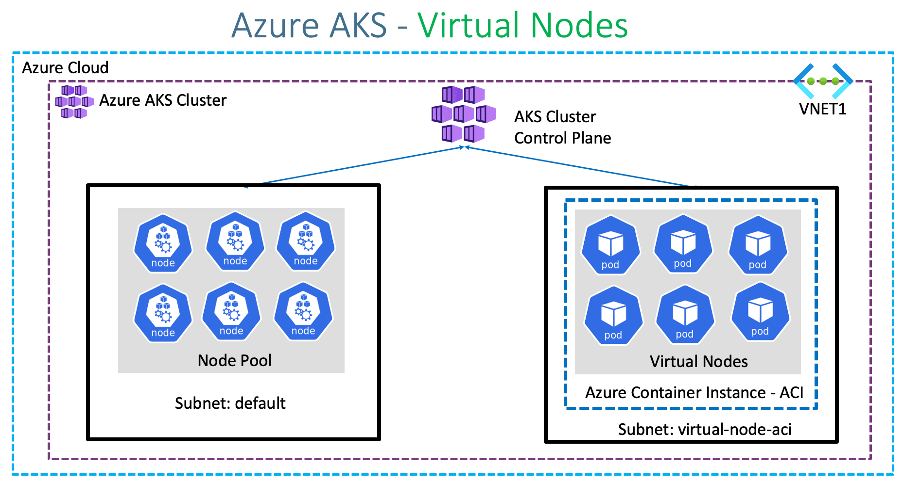

# **Node Pools:**

- In Azure, a node pool is a group of nodes within an Azure Kubernetes Service (AKS) cluster.
- These nodes are the underlying virtual machines (VMs) that run your kubernetes applications.
- Node Pools allow you to customize and manage the compute resources for different workloads withim your AKS cluster.

### **Benefits:**
-----------------

**Resource Isolation:** 

- Node pools enable you to isolate different workloads within your AKS cluster. 
-   You can allocate specific resource (CPU, memory, etc..) to each node pool based on the requriements of your applications.

**Scalability:**

- Node Pools provide scalability by allowing you to add or remove nodes dynamically based on the workload demands.
- This flexibility ensures that your application can handle varying level of traffic efficiently.

**Cost Optimization:**

- By customizing the size and configuration of node pools, you can optimize costs according to the needs of your applications.
- Examole, you can create node pools with different VM sizes to match the performance requirements of your workloads.

**High Availability:**

- Node pools support high availability by distributing your application workloads across multiple nodes.
- In case of node failures, Kubernetes can automatically reschedule the affected pods to healthy nodes within the same node pool or across different node pools.

**Rolling Upgrades:**

- You can perform rolling upgrades of node to apply updates and patches to the underlying VMs without distrupting your applications.
- This ensures minimal downtime and seamless maintenance of your AKS cluster.

### **Limitations:**
--------------------

**Limited Node Size Options:**

- Azure Provides a range of VM sizes that you can use for node pools. but the available options may be limited compared to standalone VM offerings.
- This limitation might impact your ability to fine-tune the resource allocated to each node pool.

**Resource Constraints:**

- Each AKS cluster has certain resource constraints, such as the maximum number of nodes and maximum number of pods per node.
- These constraints may limit the scalibility of your applications within a single cluster, especially if you have multiple node pools.

**Management Overhead:**

- Managing multiple node pools adds complexity to your AKS cluster configuration and maintenance tasks.
- You need to carefully plan and monitor the resources allocated to each node pool to ensure optimal performance and cost efficiency.

**Regional Availability:**

- Not all Azure regions support AKS or all types of VM sizes for node pools.
- You may encounter limitations in terms of regional availability when deploying AKS clusters with multiple node pools.

Overall, node pools in Azure AKS offer significant benefits in terms of resource management, scalability, and high availability for kubernetes workloads. However, it's essential to consider the limitations and plan your AKS cluster architecture accordingly to maximize efficiency and reliability.