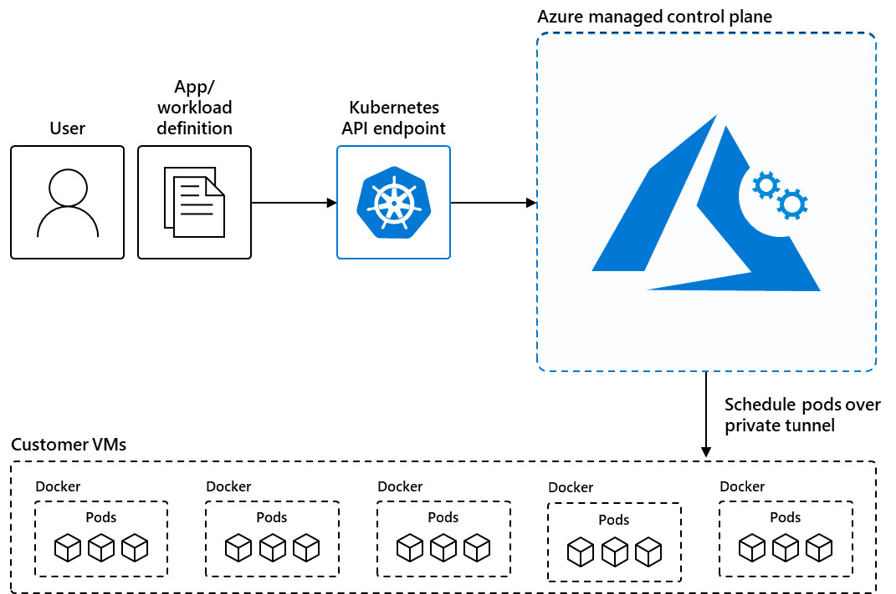
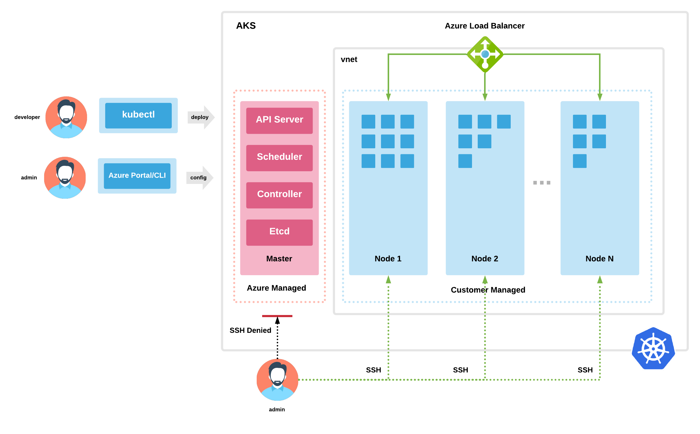

# **Azure Kubernetes Service (AKS)**

### **What is Azure Kubernetes Service(AKS)?**

- `Azure Kubernetes Service (AKS)` is a managed kubernetes service that we can use to deploy and manage containerized applications.
- We don't need container orchestration expertise to use AKS.
- AKS rdeuces the complexity and operational overhead of managing Kubernetes by offloading much of that responsibility to Azure.
- AKS is an ideal platform for deploying and managing containerized applications that require high availability, scalibility and portability and for deploying applications to multiple regions, using open-source tools and integrating with existing DevOps tools.
- When we create an AKS cluster, Azure automatically creates and configures a control plane for you at no cost.
- The Azure platform manages the AKS control plane, which is responsible for the Kubernetes objects and worker nodes that we deploy to run our applications.
- Azure takes care of critical operations like health monitoring and maintenance and you only pay for the AKS nodes that run your applications.

### **When to use AKS:**

The following list describes some of the common use cases for AKS.

- **`List and Shift to containers with AKS`:** Migrate existing applications to containers and run them in a fully-managed kubernetes environment.
- **`Microservices with AKS:** Simplify the deployment and management of microservices-based applications with streamlined horizontal scaling, self-healing, load balancing and secret management.
- **`Secure DevOps for AKS`:** Efficiently balance speed and security by implementing secure DevOps with kubernetes.
- **`Bursting from AKS with ACL`:** Use virtual nodes to provision pods inside ACL that start in seconds and scale to meet demand.
- **`Machine Learning model training with AKS`:** Train models using large datasets with familiar tools, such as TensorFlow and Kubeflow.
- **`Data Streaming with AKS`:** Ingest and process real-time data streams with millions of data points collected via sensors, and perform fast analyses and computations to develop insights into complex scenarios.
- `**Using Windows containers on AKS`:** Run Windows Server containers on AKS to modernize your Windows applications and infrastructure.

### **Features of AKS:**

Following are the key features of AKS:

#### **`Identity and Security Management`:**

- Enforce `regulatory compliance controls using Azure Policy` with built-in guardrails and internet security benchmarks
- Integrate with Kubernetes RBAC to limit access to cluster resources.
- Use `Microsoft Entra ID` to set up kubernetes access based on existing identity and group membership.

#### **`Logging and Monitoring`:**

- Integrate with `Container Insights`, a feature in Azure Monitor, to monitor the health and performance of your clusters and containerized applications.
- Set up `Network Observability` and `use BYO Prometheus and Grafana` to collect and visualize network traffic data from your clusters.

#### **`Streamlined Deployments`:**

- Use Prebuilt cluster configurations for Kubernetes with `smart defaults`.
- Autoscale your applications using the `Kubernetes Event Driven Autoscaler(KEDA)`.
- Use `Draft for AKS` to ready source code and prepare your application for production.

#### **`Clusters and Nodes`:**

- Connect storage to nodes and pods, upgrade cluster components, and use GPUs.
- Create clusters that run multiple node pools to support mixed operating systems and Windows Server containers.
- Configure automatic scaling using the `cluster autoscaler` and `horizontal pod autoscaler`.
- Deploy clusters with `confidential computing nodes` to allow containers to run in a hardware-based trusted execution environment.

#### **`Storage volume support`:**

- Mount static or dynamic storage volumes for Persistent Data.
- Use `Azure Disks` for single pod access and `Azure Files` for multiple, concurrent pod access.
- Use `Azure netApp Files` for high-performance, high-throughput, and low-latency file shares.

#### **`Networking`:**

- Leverage `Kubenet networking` for simple deployments and `Azure Container networking Interface (CNI) networking` for advanced scenarios.
- `Bring your own Container Network Interface(CNI)` to use a third-party CNI plugin.
- Easily access applications deployed to your clusters using the `application routing add-on with nginx`.

#### **`Development tooling integration`:**

- Develop AKS with `Helm`.
- Install the `Kubernetes extension for Visual Studio Code` to manage your workloads.
- Leverage the features of Istio with the `Istio-based service mesh add-on`.